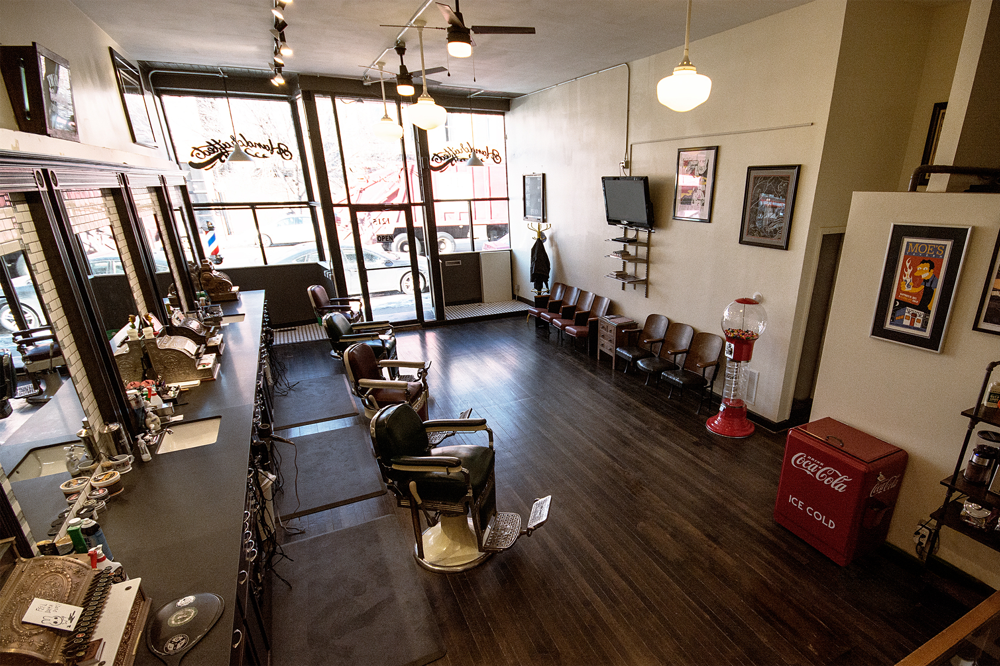

# PROJECT 3: BARBER SHOP RECOMMENDER SYSTEM

### Team Members:
* Andy Felicitas
* Jay Mandavia
* Lorenzo Yniguez
* Tommy Steed

### Objective

To some, barbershops may seem like a thing of the past. However, with the ubiquity of the hipster movement: edgy hairstyles, beards and whisky, a resurgence of barbershops is occurring throughout the states.  By 2020, the industry is estimated to reach $26B and many barbershops, salons and men's grooming centers are trying to find their space within this growing market. 

Our goals for this project are to:

1) Develop a barber shop recommender system based on demographics and yelp reviews. 

2) Utilize survey data and client base data to predict how much a client will spend and if they will be likely to purchase a hair product. We will create actionable insights that local barbers can use to grow and improve their businesses.

### Data Wrangling

Data will be collected through an online survey using Google Forms, Yelp, and Google api(s). 

We'll utilize Python to scrape, clean and organize our data.

Our datasets will then be used to train a predictive model in R and Python.

We'll display our predictions through a dynamic, interactive Shiny Dashboard and PowerBI  .

### Questions to answer
* #### Local barbershops will able to answer the following:

    * The importance of price, convenience, atmosphere and products.
    * The average price spent on haircuts.
    * The frequency of haircuts / visits to the barbershop.
    * The proximity of barbershop to residence and or work.
    * Predict if clients purchase products and if it's worth carrying inventory.
    * Predict the max amount a client would spend on a haircut.

* #### Clients will able to answer the following:
    * Which barbershop best fits my needs in terms of price, convenience, location, and amenities.
    * Which barbershop would provide me with the most positive experience.

 

## Copyright

DPS Insights (C) 2018. All Rights Reserved.

